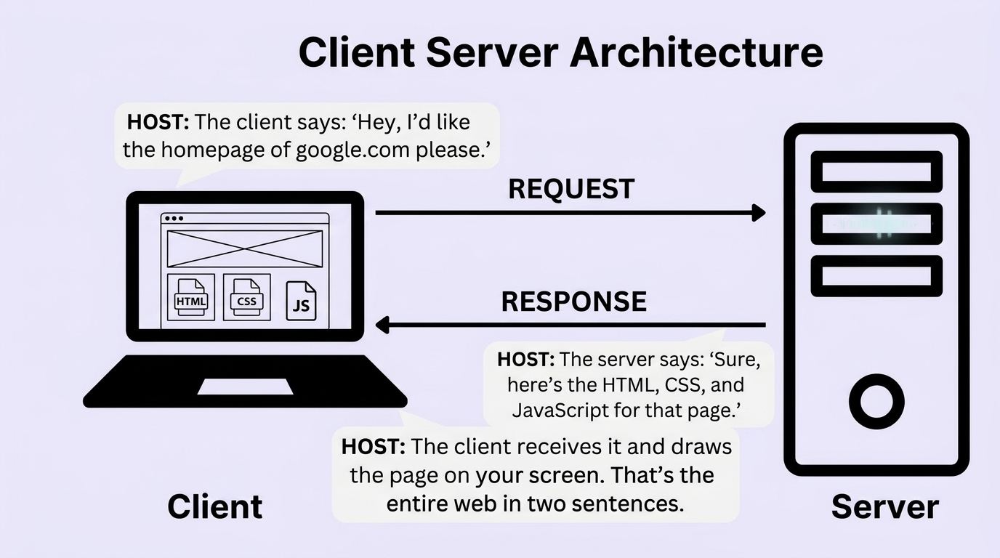
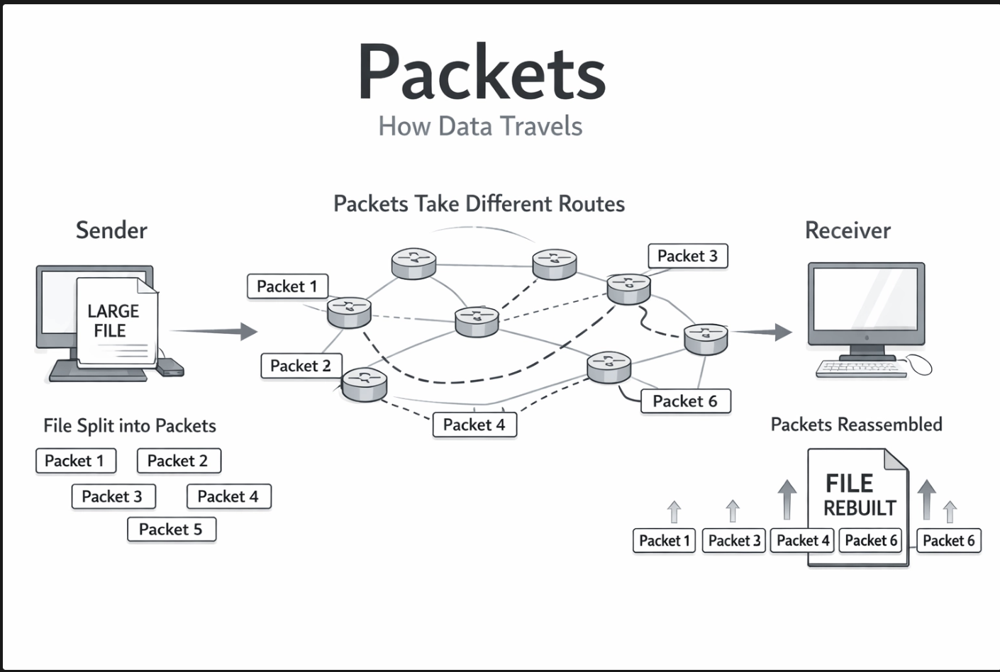
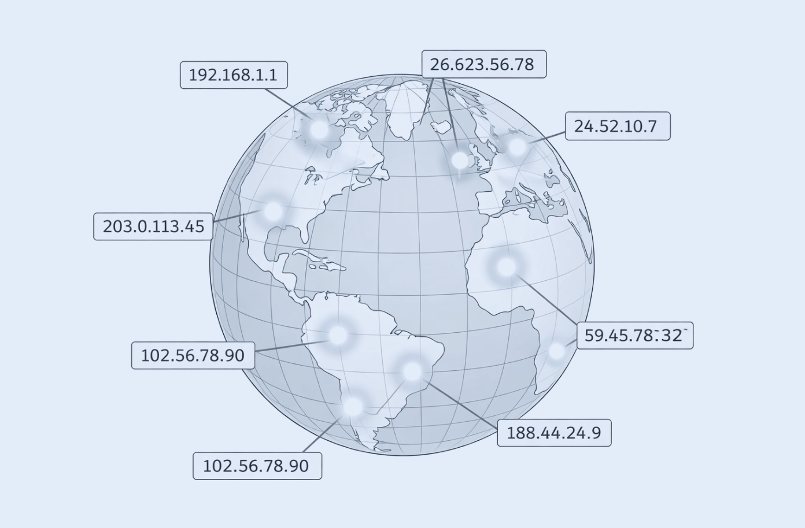
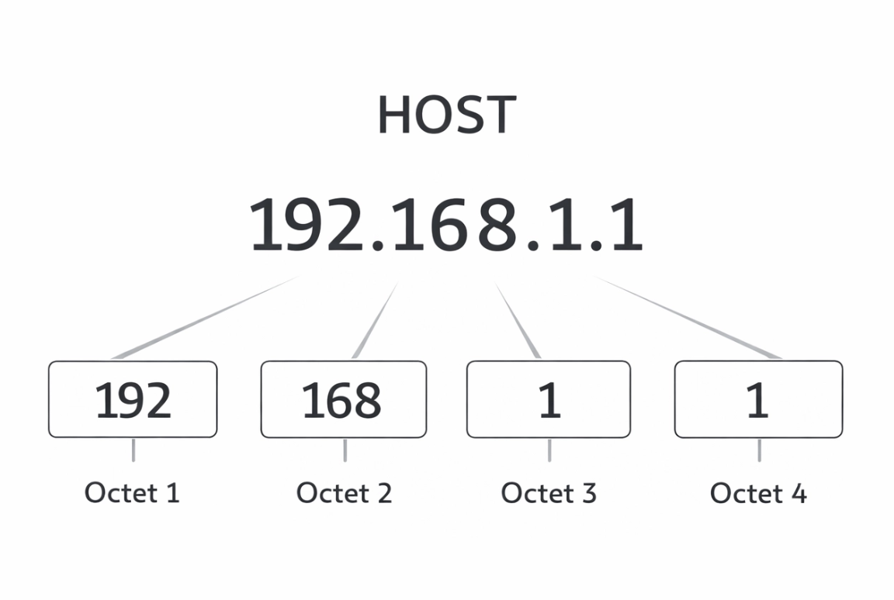
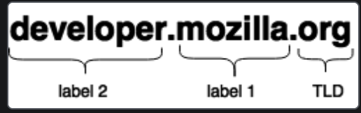
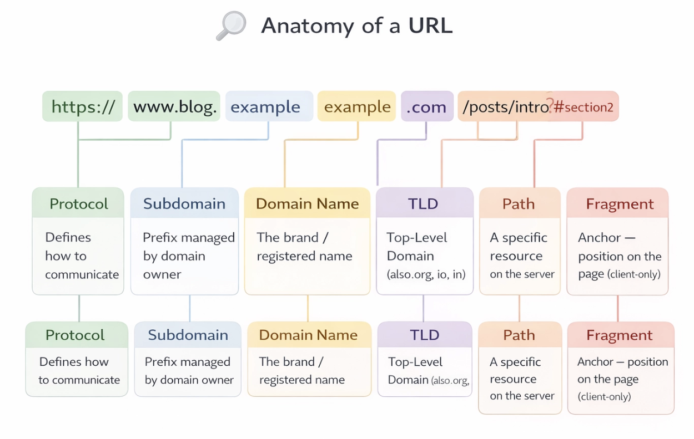
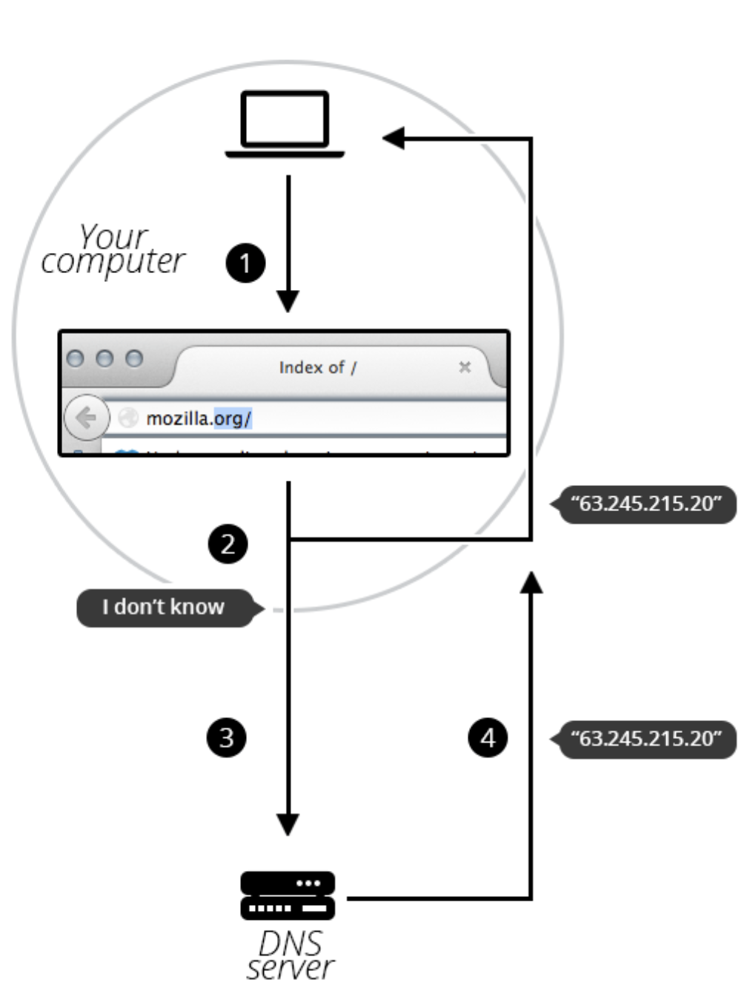
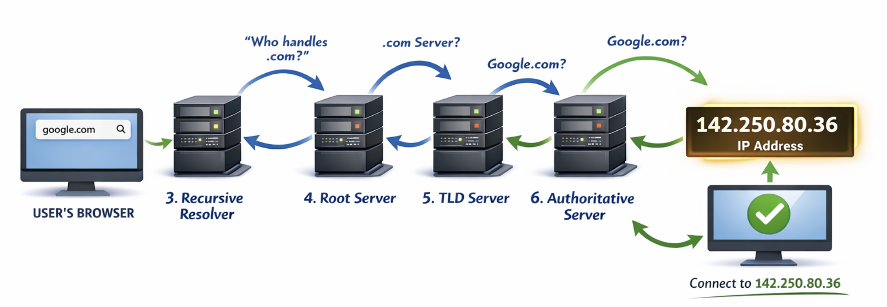

# Lets First Understand What Internet Work 

Internet is global network of Computers connect with Each other and it uses standard Protocols to do so
and how does that happen mainly 3 modes Electirc Wires Lan cables etc then wireless signals then we have optic fibers. 
and we all know when to use what 

## the Big picture
the internet is not just websites its network of computers ,computers  talking to computers 

the below image clearly explains the relation 
every device on this network is either a client or a server 
a client requests information from a server and server responds to that request with some payload

## ISP's
Interent Service providers they are your internet providers they setup you the router routing etc etc example JIO airtel

## How the data Actually Travels
#### Bits → Packets → Transmissionn
Bits and Bytes the data from client to server to server to client never moves on a single  Block of data it is always broken down into smaller n number of chunks with destination and address information they all take their own Path to reach the restination and assemble there. for this Proper assmebles and serialization is set as the client 

#### Routers 
Router: A device that directs packets of data between different networks.

## ip addresses

## IP addresss and DNS
Ip address is a way like an address of a computer on the internet to uniquly identify a system on the network 

so thats simple IP Address: A unique identifier assigned to each device on a network, used to route data to the correct destination.
we will later deep dive into IP's and stuff

AN IP is of the FORM IPV4 : four numbers seperated by dots each between 0 - 255 

IPV4 like this can cater up to 4 billion devices popolation is ever going so they get exhaused very quick and thats why we have IPV6

IPV6 has eight groups of four hexadecimal characters

 340 undecillion combination of addresses (thats 340 with 36 zeros)
example:

## Domain Names
They provide a human-readable address for any web server available on the Internet.very similar to a phone book

any interconnected system can easily identify a system by its Ip address but for humans to remember these number and strings is hard and thats why we have domain names 

#### What is a domain??

## DNS (Domain name System)
the complete flow of how the domain to IP  resolving happens 

steps 
1. Your browser checks its own cache first  has it looked this up recently?
2. If not, it asks your operating system, which checks its local cache 
3. If still not found, your OS asks your ISP's Recursive DNS Resolver.
4. The Resolver asks a Root Name Server  'Who handles .com domains?’
5. Root Server replies with the address of the .com TLD (Top-Level Domain) Server.
6. Resolver asks the TLD Server — 'Who is authoritative for [google.com](http://google.com/)?'
7. TLD Server replies with Google's Authoritative Name Server address.
8. Resolver asks Google's Authoritative Name Server — 'What's the IP for [google.com](http://google.com/)?
9. Finally! IP address returned. Resolver caches it. Browser gets it. Connection begins.

## Web Hosting
web hosting is a service which lets you place your website on someonelse server to run it and display nothing but just renting a server
#### types of Hosting
 - Shared :multiple websites share the same server and its resources
 - VPS : dedicated slice of server resources within a shared physical machine
 - Cloud :entire physical server exclusively for your website or applications
 - Dedicated : network of connected servers to distribute resources and handle demand dynamically

## Browsers

